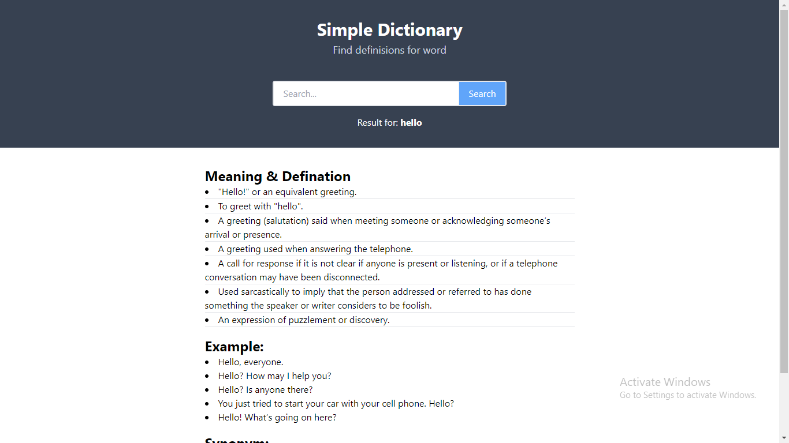

# Dictionary App

## Tech Stack:

  "@types/react": "^18.0.24",
    "@types/react-dom": "^18.0.8",
    "@vitejs/plugin-react": "^2.2.0",
    "autoprefixer": "^10.4.13",
    "postcss": "^8.4.18",
    "tailwindcss": "^3.2.2",
    "vite": "^3.2.3"

<h1>Snapshots of our project</h1>

1. Landing page

 

